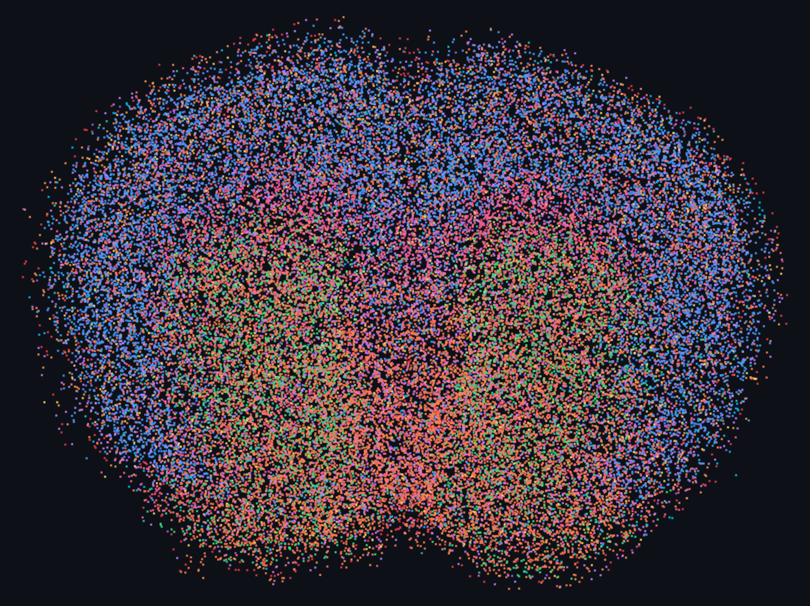
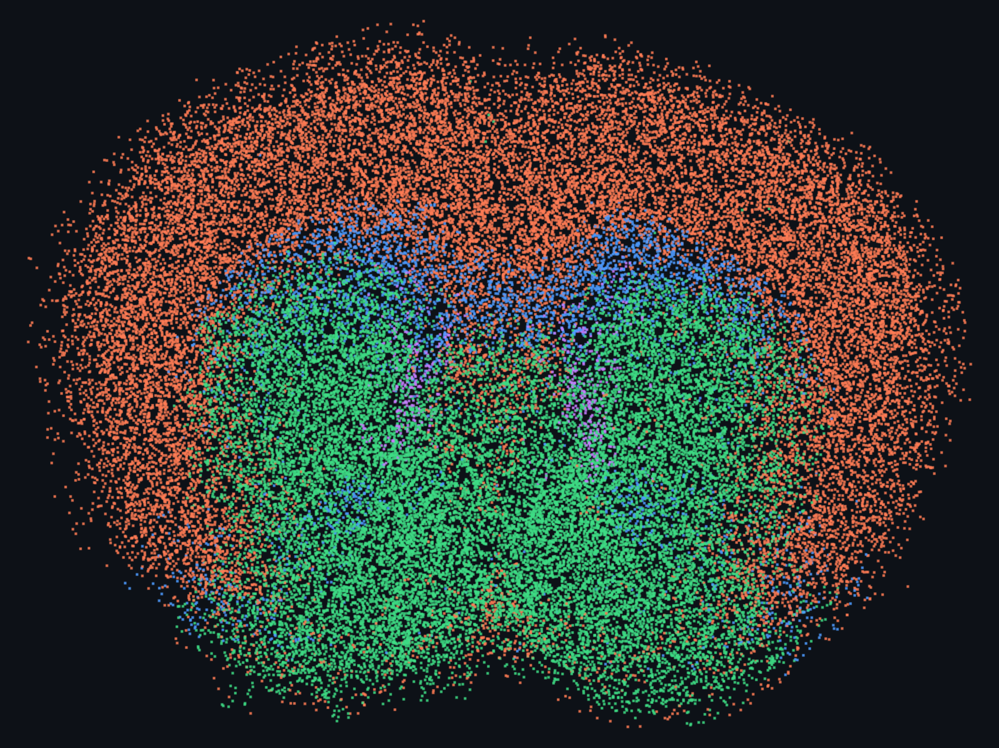
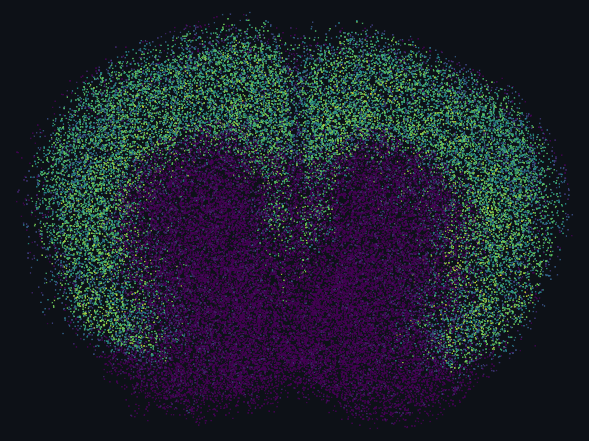
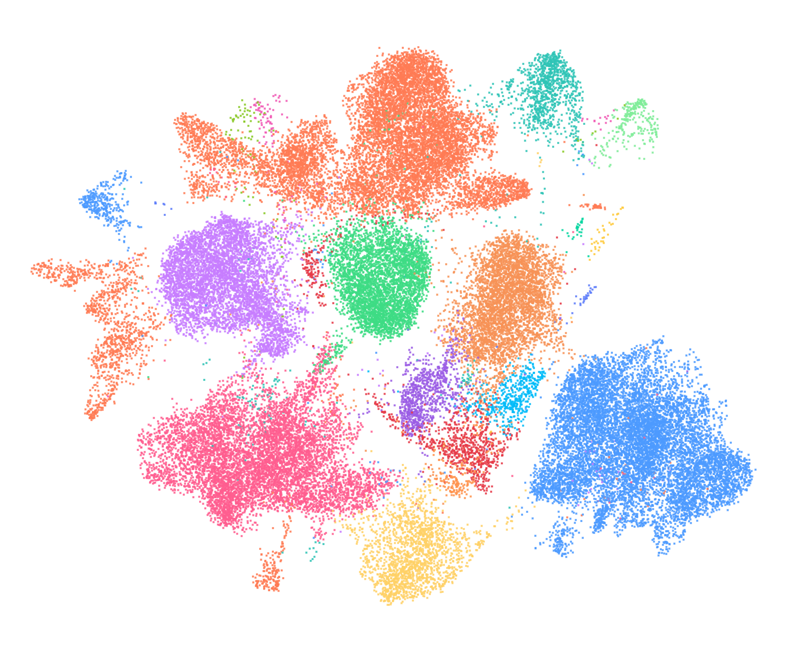
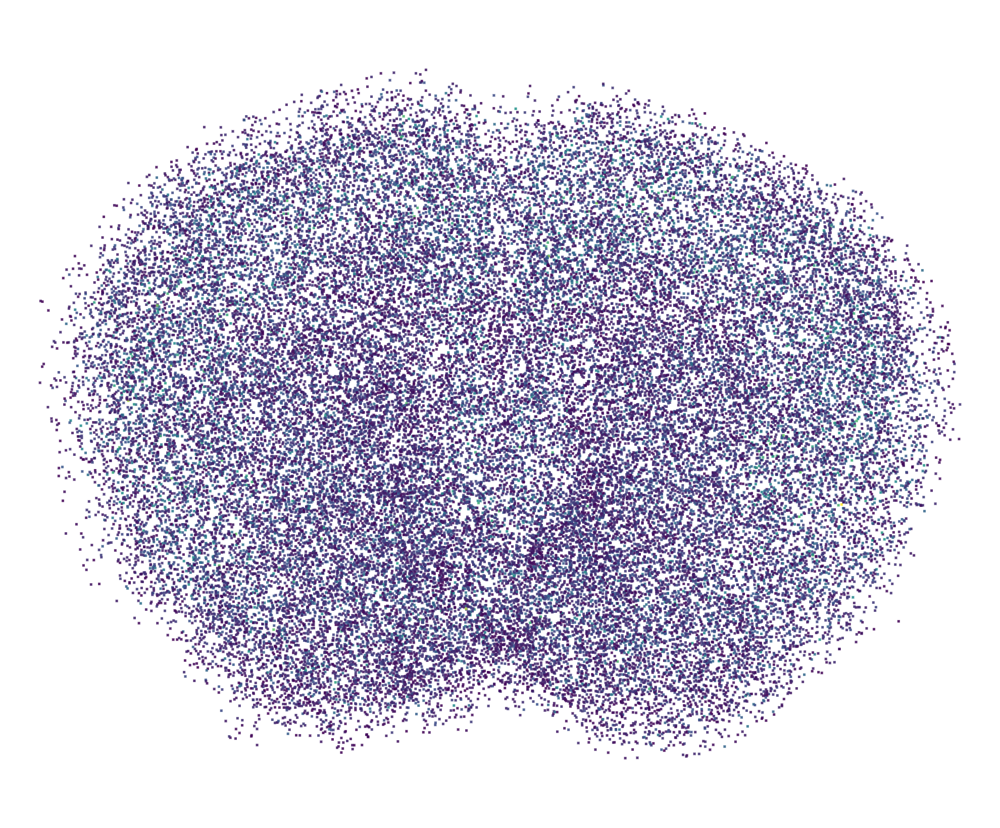
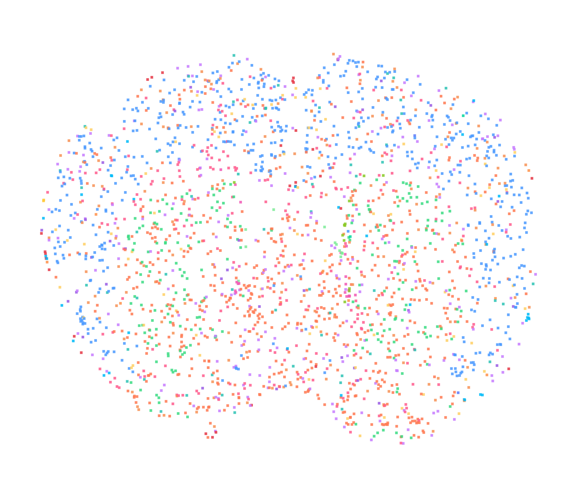
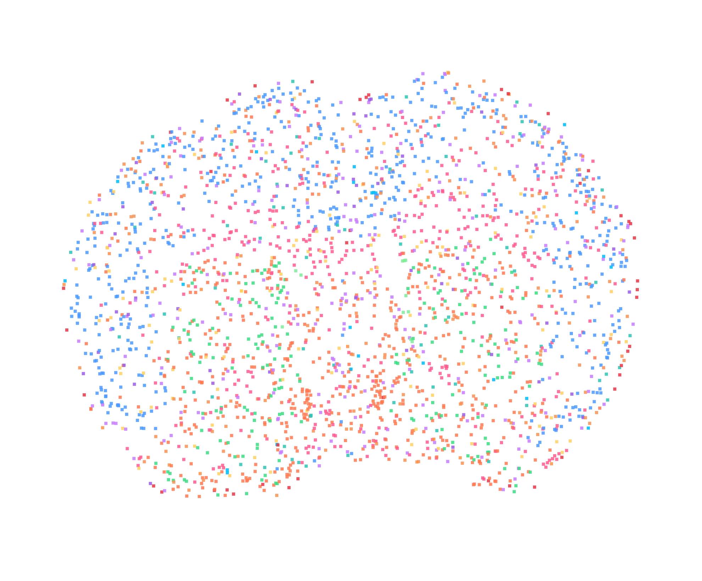
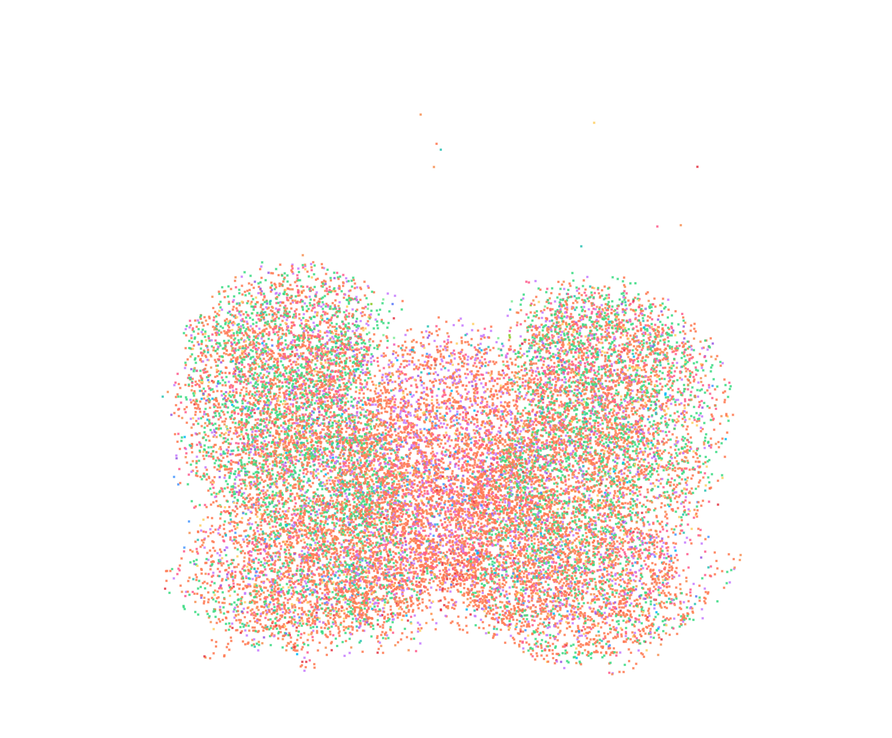
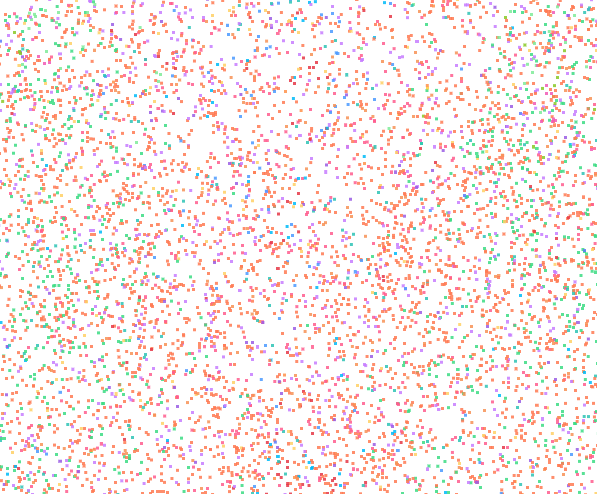

# Coronal Aging Atlas — Demo

An in-browser, dependency-free viewer for the `coronal_downsampled.h5ad`
mouse-brain aging MERFISH dataset — **49,998 cells × 300 genes**, rendered
client-side on an HTML canvas. No Python, no server-side compute: the whole
dataset is packed into a static binary bundle and explored in the browser.

```bash
./run.sh            # or: python3 -m http.server 8777
# open http://localhost:8777/index.html
```

---

## The interface at a glance

Color 50k cells by **cell type**, laid out in true tissue coordinates. Every
screenshot below is a live render from the viewer.



The left panel drives everything: **View** (Spatial / UMAP), **Color by**
(category, numeric field, or any of the 300 genes), **Filter**, a **Mouse age**
slider, point **Display** controls, and a clickable **Legend**.

---

## 1 · Anatomy falls out of the coloring

Switch **Color by → `region`** and the coronal structure appears on its own:
cortex (`CTX`) wrapping the outside, striatum (`STR`) filling the interior,
white-matter tracts (`CC/ACO`) threading between, and the ventricles (`VEN`).



---

## 2 · Any of the 300 genes, spatially

Search a gene and the cells recolor to a **viridis** scale (dark purple = low,
yellow = high). Here `Slc17a7`, an excitatory-neuron marker, lights up the
cortex and spares the striatum — exactly where the excitatory neurons live.



---

## 3 · The same cells in expression space

Flip **View → UMAP** to see the cells arranged by transcriptional similarity
instead of tissue position. The cell-type colors form clean, separated
clusters.



---

## 4 · Continuous covariates

**Color by** any numeric field — here `transcript_count` — to see per-cell
quantities painted straight onto the tissue, with a colorbar in the legend.



---

## 5 · Step through aging with the slider

The **Mouse age** slider walks the 20 discrete mouse ages (oldest to the
right), showing just that one animal's coronal section; the **▶** button
animates the whole timeline. Youngest (3.4 mo) and oldest (34.5 mo) below:

| 3.4 months | 34.5 months |
|---|---|
|  |  |

The slider stacks with the category filters and gene coloring, so you can watch
one gene or one cell type change across the aging series.

---

## 6 · Filter to a subset

Restrict to a single category value — here **`region = STR`** — to isolate the
striatum (21,611 cells) and drop everything else from view.



---

## 7 · Zoom to single cells

Scroll to zoom, drag to pan, double-click to reset. At high magnification each
point resolves to an individual cell; hover any cell for its full metadata
(cell type, region, mouse, age, transcript and gene counts, and the current
gene's expression).



---

## Why it's useful

- **Zero dependencies.** Everything is a static bundle (`data/coords.bin`,
  `data/expr.bin`, `data/manifest.json`) rendered on a plain canvas — trivial
  to host or share.
- **Fast to eyeball.** Instantly check whether a gene's spatial pattern lines
  up with a region or cell-type cluster, without opening a notebook.
- **Composable filters.** View, coloring, age, category filter, and legend
  toggles all combine.

## Regenerating the data bundle

If the source `.h5ad` changes, repack it:

```bash
python3 export_data.py
```
